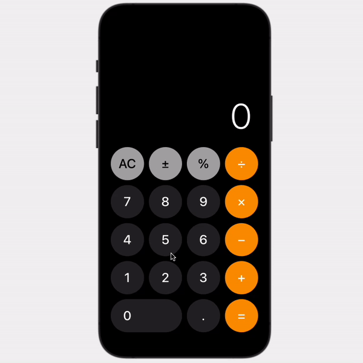

# Calculator
A clone of the iconic Apple Calculator developed with SwiftUI

This is the product of a tutorial series I published on Medium. You can find:
- Part 1 [here](https://betterprogramming.pub/build-the-apple-calculator-in-swiftui-2fad61285dc8)
- Part 2 [here](https://medium.com/better-programming/complete-the-apple-calculator-in-swiftui-using-mvvm-99571a5875b4)

